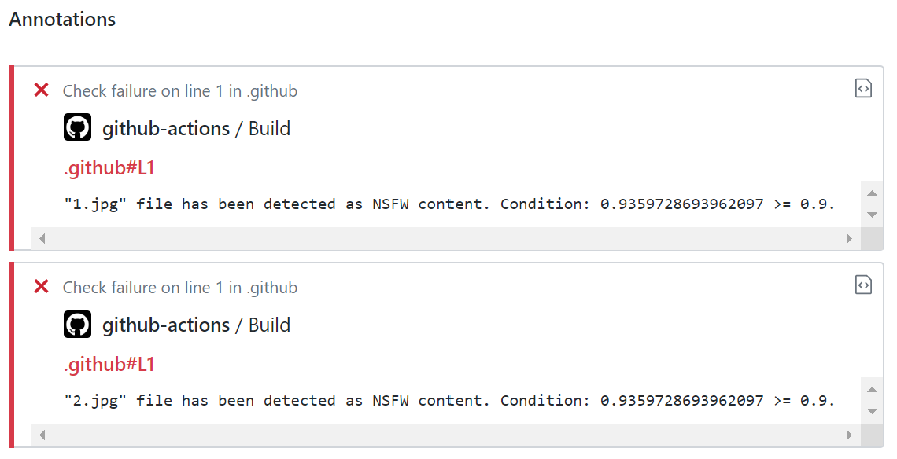

# NSFW detection action

[](https://stand-with-ukraine.pp.ua)


[](https://codeclimate.com/github/fabasoad/nsfw-detection-action/maintainability)
[](https://codeclimate.com/github/fabasoad/nsfw-detection-action/test_coverage)
[](https://snyk.io/test/github/fabasoad/nsfw-detection-action?targetFile=package.json)

This action checks each modified and added file with the extensions that is defined
in action configuration and failed in case of threshold of NSFW check is greater
or equals to the threshold defined in action configuration. NSFW detection runs
by chosen provider.

## Contents

<!-- TOC -->
* [NSFW detection action](#nsfw-detection-action)
  * [Contents](#contents)
  * [Providers](#providers)
    * [Cloudmersive](#cloudmersive)
    * [PicPurify](#picpurify)
    * [SightEngine](#sightengine)
  * [Inputs](#inputs)
  * [Example usage](#example-usage)
    * [Workflow configuration](#workflow-configuration)
    * [Result](#result)
<!-- TOC -->

## Providers

### Cloudmersive

Identifier is `cloudmersive`. Sign up to [Cloudmersive](https://cloudmersive.com/)
official website. Then go to [API Keys](https://account.cloudmersive.com/keys)
page, create a new one and copy it.

### PicPurify

Identifier is `picpurify`. Sign up to [PicPurify](https://www.picpurify.com/)
official website. Then go to [API Keys](https://www.picpurify.com/apikey.html)
page and copy `API key` that is located on the top of the page.

### SightEngine

Identifier is `sightengine`. Sign up to [SightEngine](https://sightengine.com/)
official website. Then go to [Get Started](https://dashboard.sightengine.com/getstarted)
page and copy API user and API secret from the examples provided. This provider
requires to provide 2 API identifiers, so please put them into `api-key` parameter
separated by comma. For example, `api-key` should be _123456,abcdef_ if your
`api_user` is _123456_ and `api_secret` is _abcdef_.

## Inputs

| Name         | Required | Description                                                                                   | Default                          | Possible values                  |
|--------------|----------|-----------------------------------------------------------------------------------------------|----------------------------------|----------------------------------|
| github-token | Yes      | GitHub token                                                                                  |                                  | &lt;String&gt;                   |
| provider     | Yes      | Provider identifier                                                                           |                                  | &lt;String&gt;                   |
| api-key      | Yes      | API key that should be used for chosen `provider`                                             |                                  | &lt;String&gt;                   |
| threshold    | Yes      | Action will be failed in case NSFW detection value will be greater or equal to this parameter |                                  | &lt;Float&gt;                    |
| type         | No       | Type of committed files separated by comma                                                    | `modified,added,renamed`         | `modified,added,renamed`         |
| extensions   | No       | List of file extensions separated by comma                                                    | `jpeg,jpg,png,gif,webp,tiff,bmp` | `jpeg,jpg,png,gif,webp,tiff,bmp` |

## Example usage

### Workflow configuration

```yaml
name: Test

on: push

jobs:
  nsfw-detection:
    name: Verify files
    runs-on: ubuntu-latest
    steps:
      - uses: actions/checkout@v4
      - uses: fabasoad/nsfw-detection-action@v3
        with:
          provider: picpurify
          threshold: 0.9
          type: modified,added,renamed
          extensions: jpg,jpeg
          github-token: ${{ github.token }}
          api-key: ${{ secrets.PICPURIFY_API_KEY }}
```

### Result


